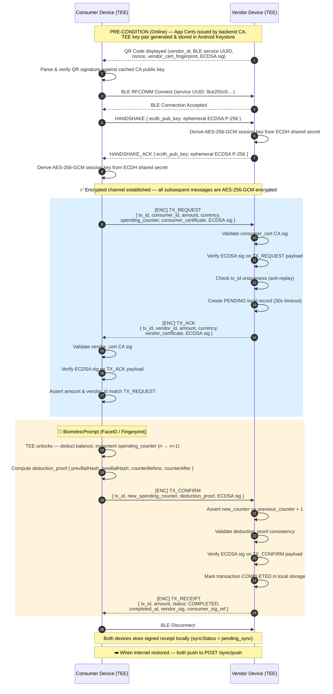
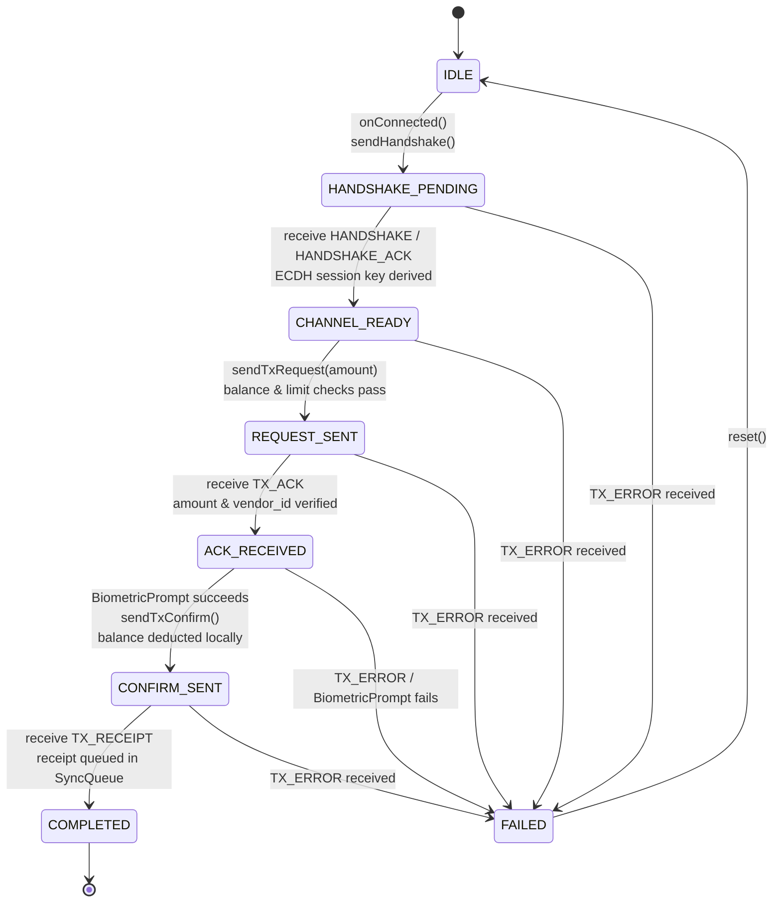
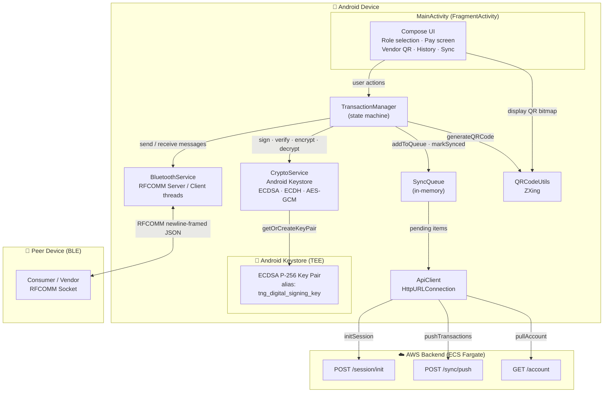
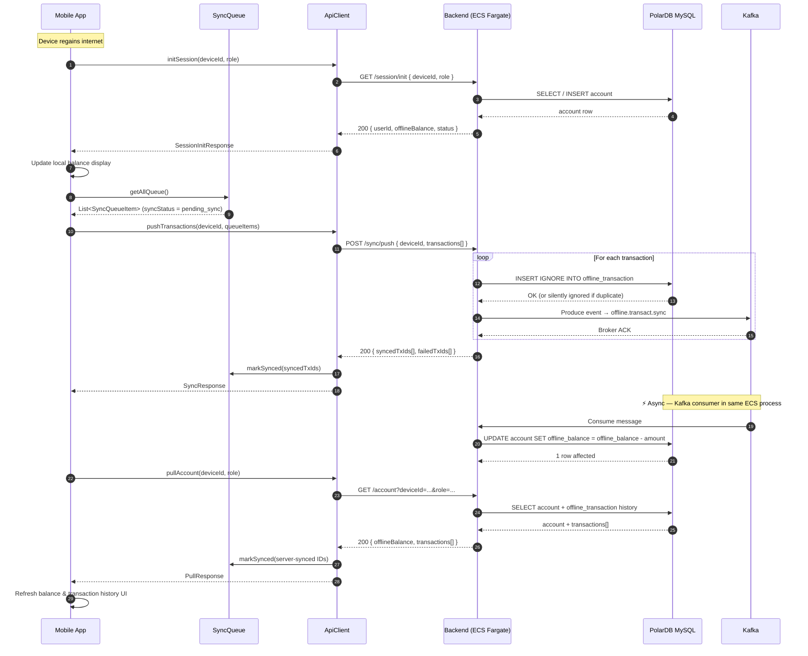
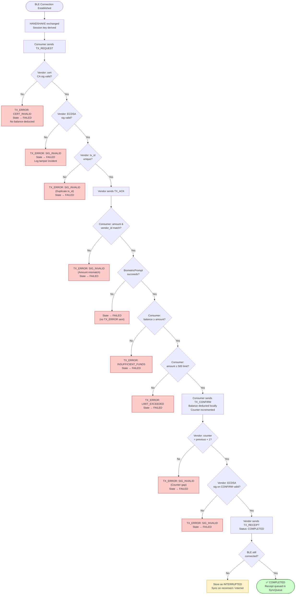

# TNG Digital — Android Mobile App (Official Project Documentation)

> **Project:** TNG Digital — Offline Bluetooth Payment Mobile Client  
> **Version:** 1.0  
> **Generated:** April 2026

---

## Table of Contents

1. [Project Overview](#1-project-overview)
2. [Technology Stack](#2-technology-stack)
3. [Architecture & Design](#3-architecture--design)
4. [API Details](#4-api-details)
5. [Authentication & Authorization](#5-authentication--authorization)
6. [Data Models](#6-data-models)
7. [Error Handling](#7-error-handling)
8. [Configuration & Environment](#8-configuration--environment)
9. [Setup & Running the Project](#9-setup--running-the-project)
10. [Testing](#10-testing)
11. [Deployment](#11-deployment)
12. [Assumptions, Limitations & Future Improvements](#12-assumptions-limitations--future-improvements)
13. [System Diagrams](#13-system-diagrams)

---

## 1. Project Overview

### 1.1 Project Name

**TNG Digital — Offline Bluetooth Payment Mobile Client**

### 1.2 Purpose & Business Problem

This is the **Android mobile client** for the Global E-Wallet system. It enables consumers and merchants to conduct **fully offline, cryptographically secured peer-to-peer payments** using Bluetooth Classic (RFCOMM) when internet connectivity is unavailable.

Key problems solved:

- **Offline payment execution** — Transactions are negotiated entirely over a Bluetooth encrypted channel with no internet dependency.
- **Cryptographic security** — Android Keystore (hardware-backed) ECDSA P-256 keys sign every transaction step, ensuring integrity and non-repudiation.
- **Session confidentiality** — ECDH key exchange establishes a shared AES-256-GCM session key per connection, preventing eavesdropping.
- **Double-spend prevention** — A monotonic spending counter is tracked and incremented per transaction; vendors reject out-of-sequence confirmations.
- **Async cloud sync** — Completed offline transactions are queued locally and pushed to the backend when internet is restored.

### 1.3 Target Users

- **Consumers (payers):** End-users who pay merchants using the app's Consumer mode.
- **Merchants/Vendors (payees):** Businesses that accept BLE payments via the app's Vendor mode.

### 1.4 High-Level Architecture

The app is a **single-Activity Android application** using Jetpack Compose for the UI. It contains:

- A **role-selection UI** (Consumer or Vendor) backed by a single `TransactionManager` with role-specific logic.
- A **BluetoothService** layer managing RFCOMM socket lifecycle (server and client modes).
- A **CryptoService** layer wrapping Android Keystore, ECDH, AES-GCM, and ECDSA.
- An **ApiClient** layer for communicating with the cloud backend (ECS Fargate on AWS).
- An in-memory **SyncQueue** that holds completed transactions pending server sync.

---

## 2. Technology Stack

| Category | Technology |
|---|---|
| **Language** | Kotlin |
| **UI Framework** | Jetpack Compose (Material3) |
| **Min SDK** | API 29 (Android 10) |
| **Target SDK** | API 36 |
| **Bluetooth** | Android Bluetooth Classic — RFCOMM (`BluetoothServerSocket` / `BluetoothSocket`) |
| **Cryptography** | Android Keystore (ECDSA P-256), ECDH, AES-256-GCM, SHA-256 — `javax.crypto`, `java.security` |
| **QR Code** | ZXing Core + ZXing Android Embedded (`journeyapps`) |
| **Biometrics** | AndroidX Biometric (`BiometricPrompt`) |
| **HTTP Client** | `java.net.HttpURLConnection` (stdlib, no third-party) |
| **Async** | Kotlin Coroutines (`Dispatchers.IO`) |
| **Build System** | Gradle (Kotlin DSL) |
| **Backend URL** | `http://finhack-alb-2062571595.ap-southeast-5.elb.amazonaws.com` (AWS ALB) |

---

## 3. Architecture & Design

### 3.1 Overall Architectural Style

The application follows a **single-Activity, service-layer architecture** without a formal MVVM layer. Business logic lives in dedicated `object`/`class` service singletons, and all UI state is managed via Compose `remember`/`mutableStateOf` inside `MainActivity`.

### 3.2 Key Components & Responsibilities

| Component | Type | Responsibility |
|---|---|---|
| `MainActivity` | `FragmentActivity` | App entry point, permission handling, BT broadcast receiver, Compose UI host |
| `TransactApp` | `@Composable` | Root composable — role selection, screen routing |
| `TransactionManager` | `class` | Core transaction state machine; orchestrates the 4-step BLE protocol (HANDSHAKE → TX_REQUEST → TX_ACK → TX_CONFIRM → TX_RECEIPT) |
| `BluetoothService` | `class` | RFCOMM server/client threads; newline-delimited message framing |
| `CryptoService` | `object` | Android Keystore key management, ECDSA sign/verify, ECDH session key derivation, AES-GCM encrypt/decrypt |
| `ApiClient` | `object` | HTTP calls to backend: session init, sync push, account pull |
| `SyncQueue` | `object` | In-memory queue of `SyncQueueItem`; holds completed transactions until cloud-synced |
| `QRCodeUtils` | `object` | ZXing-based QR bitmap generation |
| `TransactionModels` | enums/data classes | Protocol message types, transaction status, all data shapes |
| `ApiTypes` | data classes | API request/response DTOs |

### 3.3 Folder / Package Structure

```
app/src/main/
├── AndroidManifest.xml
├── java/com/example/tng_digital/
│   ├── MainActivity.kt          # Activity + all Compose UI
│   ├── BluetoothService.kt      # RFCOMM socket lifecycle
│   ├── CryptoService.kt         # Keystore, ECDSA, ECDH, AES-GCM
│   ├── TransactionManager.kt    # BLE transaction state machine
│   ├── TransactionModels.kt     # Enums & data classes (protocol)
│   ├── SyncQueue.kt             # In-memory offline tx queue
│   ├── ApiClient.kt             # HTTP calls to backend
│   ├── ApiTypes.kt              # API request/response DTOs
│   ├── QRCodeUtils.kt           # ZXing QR code generation
│   └── ui/theme/                # Compose color/typography theme
└── res/                         # Android resources
```

### 3.4 Transaction State Machine

`TransactionManager` drives all BLE protocol steps through `TransactionState`:

```
IDLE
  │ onConnected() — sendHandshake()
  ▼
HANDSHAKE_PENDING
  │ peer sends HANDSHAKE / HANDSHAKE_ACK
  ▼
CHANNEL_READY          ← AES-256-GCM session key established
  │ Consumer: sendTxRequest(amount)
  ▼
REQUEST_SENT
  │ Vendor sends TX_ACK
  ▼
ACK_RECEIVED
  │ Consumer: biometric auth succeeds → sendTxConfirm()
  ▼
CONFIRM_SENT
  │ Vendor sends TX_RECEIPT
  ▼
COMPLETED              ← receipt queued in SyncQueue
  
  (any step can → FAILED on TX_ERROR)
```

### 3.5 Request → Response Lifecycle (BLE Transaction)

```
Consumer Device                              Vendor Device
     │                                             │
     │─── BLE RFCOMM Connect ─────────────────────►│
     │                                             │
     │─── HANDSHAKE {ecdh_pub_key} ───────────────►│
     │◄── HANDSHAKE_ACK {ecdh_pub_key} ────────────│
     │  [Both derive AES-256-GCM session key]      │
     │                                             │
     │─── [ENC] TX_REQUEST ───────────────────────►│
     │   {tx_id, amount, consumer_cert, sig}       │  Vendor validates cert + sig
     │◄── [ENC] TX_ACK ────────────────────────────│
     │   {tx_id, amount, vendor_cert, sig}         │  Consumer validates amount match
     │                                             │
     │  [Biometric prompt — FaceID/Fingerprint]    │
     │  [TEE: deduct balance, increment counter]   │
     │─── [ENC] TX_CONFIRM ───────────────────────►│
     │   {deduction_proof, new_counter, sig}       │  Vendor validates counter + proof
     │◄── [ENC] TX_RECEIPT ────────────────────────│
     │   {vendor_sig, status: COMPLETED}           │
     │                                             │
     │─── BLE Disconnect ─────────────────────────►│
     │                                             │
     ▼ (when internet restored)                    ▼
   POST /sync/push                         POST /sync/push
```

### 3.6 Sync Lifecycle (Cloud)

When internet is restored, either device calls:

1. **Session init** — `POST /session/init` identifies the device and retrieves current balance.
2. **Sync push** — `POST /sync/push` uploads all pending `SyncQueueItem` entries.
3. **Account pull** — `GET /account` retrieves the server's reconciled balance and marks queue items as `"synced"`.

---

## 4. API Details

**Base URL (hardcoded):** `http://finhack-alb-2062571595.ap-southeast-5.elb.amazonaws.com`  
**Timeout:** 10 seconds (connect + read)  
**Content-Type:** `application/json`

---

### 4.1 `GET /session/init` — Session Initialisation

> Note: The spec sends a JSON body on `GET` (non-standard). The backend `/session/init` endpoint accepts this format.

**Called by:** `ApiClient.initSession(req: SessionInitRequest)`

**Request Body:**
```json
{
  "deviceId": "DEV-Pixel-9",
  "role": "user"
}
```

| Field | Type | Description |
|---|---|---|
| `deviceId` | `string` | Derived from `Build.MODEL` prefixed with `"DEV-"` |
| `role` | `string` | `"user"` (consumer) or `"merchant"` |

**Success Response `200 OK`:**
```json
{
  "userId": "DEV-Pixel-9",
  "displayName": "User Pixel-9",
  "offlineBalance": 1000.0,
  "status": "active",
  "merchantName": "Store Pixel-9"
}
```

> `merchantName` is present only when `role = "merchant"`.

**Error:** Throws `ApiClient.ApiException` on non-200 response.

---

### 4.2 `POST /sync/push` — Push Offline Transactions

**Called by:** `ApiClient.pushTransactions(req: SyncRequest)`

**Request Body:**
```json
{
  "deviceId": "DEV-Pixel-9",
  "transactions": [
    {
      "txId": "b7c9d1e3-4f5a-6b7c-8d9e-0f1a2b3c4d5e",
      "side": "user",
      "queuedAt": 1745571660000,
      "tx": {
        "id": "b7c9d1e3-4f5a-6b7c-8d9e-0f1a2b3c4d5e",
        "amount": 25.50,
        "currency": "MYR",
        "timestamp": 1745571660000,
        "fromUserId": "CSM-1745571600000",
        "toMerchantId": "VND-1745571600000",
        "status": "completed",
        "syncStatus": "pending_sync",
        "signature": "<ECDSA sig>",
        "userPubKey": "<base64 pub key>",
        "cert": "<JSON string of ConsumerCertificate>",
        "ackSignature": "<vendor receipt sig>",
        "merchantPubKey": "<base64 vendor pub key>"
      }
    }
  ]
}
```

**Success Response `200 OK`:**
```json
{
  "syncedTxIds": ["b7c9d1e3-4f5a-6b7c-8d9e-0f1a2b3c4d5e"],
  "failedTxIds": []
}
```

> If the server returns `200` with an empty body or no `syncedTxIds`, the client treats all submitted transactions as synced.

**Error:** Throws `ApiException` on non-200. All `failedTxIds` remain with `syncStatus = "pending_sync"` in the queue.

---

### 4.3 `GET /account` — Pull Account & Transaction History

**Called by:** `ApiClient.pullAccount(req: PullRequest)`

**Query Parameters:**

| Parameter | Example | Description |
|---|---|---|
| `deviceId` | `DEV-Pixel-9` | Device identifier |
| `role` | `user` | `"user"` or `"merchant"` |

**Example:** `GET /account?deviceId=DEV-Pixel-9&role=user`

**Success Response `200 OK`:**
```json
{
  "offlineBalance": 974.5,
  "transactions": [
    {
      "id": "b7c9d1e3-4f5a-6b7c-8d9e-0f1a2b3c4d5e",
      "amount": 25.50,
      "currency": "MYR",
      "timestamp": 1745571660,
      "fromUserId": "CSM-1745571600000",
      "toMerchantId": "VND-1745571600000",
      "status": "completed",
      "syncStatus": "synced"
    }
  ]
}
```

After a successful pull, `SyncQueue.markSynced()` is called for any transaction IDs returned with `syncStatus = "synced"`.

---

## 5. Authentication & Authorization

There is **no API-layer authentication** in the current MVP. All backend endpoints are publicly accessible.

Security is enforced at the **transaction layer**:

- **Android Keystore** — The ECDSA P-256 signing key is hardware-backed (alias: `tng_digital_signing_key`). The private key never leaves the secure hardware.
- **ECDH Session Encryption** — Each BLE connection establishes a unique ephemeral `secp256r1` keypair. ECDH shared secret is SHA-256-derived into an AES-256-GCM session key.
- **ECDSA Message Signing** — Every BLE protocol message (`TX_REQUEST`, `TX_ACK`, `TX_CONFIRM`, `TX_RECEIPT`) is signed with the device's long-term Keystore key.
- **Biometric Gate** — `TX_CONFIRM` (the balance deduction step) is only sent after a successful `BiometricPrompt` authentication. A stolen device cannot spend funds without the owner's biometrics.
- **Spending Counter** — Increments monotonically per transaction. Vendors reject `TX_CONFIRM` if `new_counter ≠ previous_counter + 1`.
- **Certificate Validation** — `ConsumerCertificate` and `VendorCertificate` are embedded in `TX_REQUEST`/`TX_ACK` respectively. In the MVP, the CA signature is set to `"SIMULATED_CA_SIG"` — production should verify against a real CA.

---

## 6. Data Models

### 6.1 Protocol Message Types (`TransactionModels.kt`)

#### `MessageType` (enum)

| Code | Direction | Purpose |
|---|---|---|
| `HANDSHAKE` | Initiator → Responder | ECDH public key exchange (step 1) |
| `HANDSHAKE_ACK` | Responder → Initiator | ECDH public key response (step 1) |
| `TX_REQUEST` | Consumer → Vendor | Transaction request with amount and consumer certificate |
| `TX_ACK` | Vendor → Consumer | Vendor ready confirmation with vendor certificate |
| `TX_CONFIRM` | Consumer → Vendor | Biometric-gated deduction proof and new spending counter |
| `TX_RECEIPT` | Vendor → Consumer | Transaction completion receipt with vendor signature |
| `TX_ERROR` | Either → Either | Error/abort with reason code |
| `TX_TIMEOUT` | Either → Either | Transaction timeout notification |

#### `TxStatus` (enum)

`PENDING`, `COMPLETED`, `INTERRUPTED`, `EXPIRED`, `FAILED`, `FLAGGED`

#### `TransactionState` (enum — internal state machine)

`IDLE`, `HANDSHAKE_PENDING`, `CHANNEL_READY`, `REQUEST_SENT`, `ACK_RECEIVED`, `CONFIRM_SENT`, `COMPLETED`, `FAILED`

### 6.2 Certificate Types

#### `ConsumerCertificate`

| Field | Type | Description |
|---|---|---|
| `consumerId` | `String` | `"CSM-<timestamp>"` |
| `deviceId` | `String` | `"DEV-<Build.MODEL>"` |
| `publicKey` | `String` | Base64-encoded ECDSA P-256 public key |
| `expiry` | `String` | ISO-8601 timestamp (24h from generation) |
| `maxOfflineSpendLimit` | `Double` | Default: `500.00` |
| `caSignature` | `String` | `"SIMULATED_CA_SIG"` in MVP |

#### `VendorCertificate`

| Field | Type | Description |
|---|---|---|
| `vendorId` | `String` | `"VND-<timestamp>"` |
| `deviceId` | `String` | `"DEV-<Build.MODEL>"` |
| `publicKey` | `String` | Base64-encoded ECDSA P-256 public key |
| `merchantName` | `String` | `"TNG Demo Vendor"` |
| `expiry` | `String` | ISO-8601 timestamp (24h from generation) |
| `caSignature` | `String` | `"SIMULATED_CA_SIG"` in MVP |

### 6.3 BLE Message Payloads

#### `TxRequest`

| Field | Type | Description |
|---|---|---|
| `txId` | `String` | UUIDv4 |
| `consumerId` | `String` | Consumer identity |
| `amount` | `Double` | Transaction amount |
| `currency` | `String` | Default: `"MYR"` |
| `timestamp` | `Long` | Unix epoch (seconds) |
| `spendingCounter` | `Int` | Monotonic counter (current + 1) |
| `consumerCertificate` | `ConsumerCertificate` | Inline certificate |
| `signature` | `String` | ECDSA over `"txId|consumerId|amount|currency|ts|counter"` |

#### `TxAck`

| Field | Type | Description |
|---|---|---|
| `txId` | `String` | Echoes consumer's txId |
| `vendorId` | `String` | Vendor identity |
| `merchantName` | `String` | Human-readable vendor name |
| `amount` | `Double` | Echoed amount (must match TX_REQUEST) |
| `currency` | `String` | Echoed currency |
| `timestamp` | `Long` | Vendor timestamp |
| `vendorCertificate` | `VendorCertificate` | Inline certificate |
| `signature` | `String` | ECDSA over `"txId|vendorId|amount|currency|VENDOR_READY|ts"` |

#### `TxConfirm`

| Field | Type | Description |
|---|---|---|
| `txId` | `String` | Transaction ID |
| `consumerId` | `String` | Consumer identity |
| `vendorId` | `String` | Vendor identity |
| `amount` | `Double` | Amount |
| `currency` | `String` | Currency |
| `newSpendingCounter` | `Int` | Previous counter + 1 |
| `timestamp` | `Long` | Unix epoch |
| `deductionProof` | `DeductionProof` | SHA-256 hashes of balance state before/after |
| `signature` | `String` | ECDSA over all above fields |

#### `DeductionProof`

| Field | Type | Description |
|---|---|---|
| `previousBalanceHash` | `String` | SHA-256 of balance before deduction |
| `newBalanceHash` | `String` | SHA-256 of balance after deduction |
| `counterBefore` | `Int` | Spending counter before |
| `counterAfter` | `Int` | Spending counter after |

#### `TxReceipt`

| Field | Type | Description |
|---|---|---|
| `txId` | `String` | Transaction ID |
| `consumerId` | `String` | Consumer identity |
| `vendorId` | `String` | Vendor identity |
| `merchantName` | `String` | Merchant display name |
| `amount` | `Double` | Amount |
| `currency` | `String` | Currency |
| `completedAt` | `String` | ISO-8601 completion time |
| `vendorSignature` | `String` | ECDSA over receipt fields |
| `consumerSignatureRef` | `String` | Reference to TX_CONFIRM consumer signature |

### 6.4 API Types (`ApiTypes.kt`)

#### `SyncQueueItem`

```kotlin
data class SyncQueueItem(
    val txId: String,
    val side: String,      // "user" | "merchant"
    val tx: ServerTransaction,
    val queuedAt: Long     // System.currentTimeMillis()
)
```

#### `ServerTransaction`

```kotlin
data class ServerTransaction(
    val id: String,
    val amount: Double,
    val currency: String,
    val timestamp: Long,
    val fromUserId: String,
    val toMerchantId: String,
    val status: String,       // "pending" | "completed"
    val syncStatus: String,   // "pending_sync" | "synced"
    val signature: String,
    val userPubKey: String,
    val cert: String,         // JSON-serialised ConsumerCertificate
    val ackSignature: String,
    val merchantPubKey: String
)
```

### 6.5 QR Payload

The vendor generates a signed QR code for the consumer to scan:

```kotlin
data class QrPayload(
    val version: Int,
    val vendorId: String,
    val merchantName: String,
    val serviceUuid: String,          // BLE service UUID
    val timestamp: Long,
    val nonce: String,                // UUIDv4 anti-replay
    val vendorCertFingerprint: String, // SHA-256 of vendor pub key (first 16 chars)
    val signature: String
)
```

---

## 7. Error Handling

### 7.1 BLE Protocol Errors

All BLE error conditions result in a `TX_ERROR` message being sent over the channel, with the following codes:

| Code | Trigger |
|---|---|
| `INSUFFICIENT_FUNDS` | Consumer local balance < requested amount |
| `LIMIT_EXCEEDED` | Requested amount > `maxOfflineSpendLimit` (500.00) |
| `SIG_INVALID` | Signature verification failure, TX_ID mismatch, amount mismatch, or counter gap |
| `UNKNOWN` | Unexpected remote error |

On receiving a `TX_ERROR`, `TransactionState` transitions to `FAILED` and the `onError` callback is invoked.

### 7.2 API Errors

`ApiClient` throws `ApiClient.ApiException` (a subclass of `Exception`) on:
- Non-200 HTTP responses.
- JSON parse failures on the response body.

Callers in `MainActivity` catch these and surface them as Android `Toast` messages.

### 7.3 Bluetooth Connection Errors

- `AcceptThread` / `ConnectThread` log `IOException` and call `onStatusChanged("Connection failed")`.
- `ConnectedThread` detects stream close and calls `onStatusChanged("Disconnected")`.
- All status changes are posted to the main thread via `Handler(Looper.getMainLooper())`.

---

## 8. Configuration & Environment

### 8.1 Hardcoded Configuration

| Setting | Value | Location |
|---|---|---|
| **Backend URL** | `http://finhack-alb-2062571595.ap-southeast-5.elb.amazonaws.com` | `ApiClient.kt` |
| **HTTP Timeout** | `10,000 ms` | `ApiClient.kt` |
| **Keystore Key Alias** | `tng_digital_signing_key` | `CryptoService.kt` |
| **BLE Service UUID** | `8ce255c0-200a-11e0-ac64-0800200c9a66` | `BluetoothService.kt` + `TransactionManager.kt` |
| **BLE Service Name** | `TngDigitalBluetooth` | `BluetoothService.kt` |
| **Merchant Name** | `TNG Demo Vendor` | `TransactionManager.kt` |
| **Starting Local Balance** | `1000.00` | `TransactionManager.kt` |
| **Starting Spending Counter** | `47` | `TransactionManager.kt` |
| **Max Offline Spend Limit** | `500.00` | `TransactionManager.kt` |
| **Certificate Expiry** | `24 hours` from generation | `TransactionManager.kt` |
| **Default Currency** | `MYR` | `TransactionManager.sendTxRequest()` |

### 8.2 Android Permissions (`AndroidManifest.xml`)

| Permission | Purpose |
|---|---|
| `BLUETOOTH` / `BLUETOOTH_ADMIN` | Legacy BT (API ≤ 30) |
| `BLUETOOTH_SCAN` | Discover nearby devices (API 31+) |
| `BLUETOOTH_ADVERTISE` | Advertise as BLE peripheral (API 31+) |
| `BLUETOOTH_CONNECT` | Connect to paired devices (API 31+) |
| `ACCESS_FINE_LOCATION` / `ACCESS_COARSE_LOCATION` | Required for BT discovery on API ≤ 30 |
| `CAMERA` | QR code scanning |
| `INTERNET` | Backend API calls |

---

## 9. Setup & Running the Project

### 9.1 Prerequisites

- Android Studio Hedgehog or later
- Android SDK API 36 installed
- A physical Android device running API 29+ *(Bluetooth RFCOMM requires a real device; emulators do not support it)*
- Java 11+

### 9.2 Build & Run

```bash
# Clone the repository
git clone <repo-url>
cd tngdigital

# Open in Android Studio and sync Gradle, or build via CLI:
./gradlew :app:assembleDebug

# Install on connected device:
./gradlew :app:installDebug
```

### 9.3 First-Time App Launch

1. Grant all requested Bluetooth and Camera permissions.
2. Enable Bluetooth on the device.
3. **Consumer mode:** Tap "Consumer" → enter amount → scan the vendor's QR code → approve biometric prompt → transaction completes.
4. **Vendor mode:** Tap "Vendor" → QR code is displayed → wait for consumer to connect → transaction completes automatically.
5. **Sync:** When online, use the "Sync" button to push queued transactions to the backend.

### 9.4 Backend Connectivity

The app targets the production AWS ALB:
```
http://finhack-alb-2062571595.ap-southeast-5.elb.amazonaws.com
```
`android:usesCleartextTraffic="true"` is set in the manifest to allow HTTP (not HTTPS) to the ALB. For production, the backend should be HTTPS and this flag should be removed.

---

## 10. Testing

### 10.1 Current State

> **MVP Notice:** No automated unit or UI tests are present in `src/test/` or `src/androidTest/`. Test stubs exist from the Gradle template only.

### 10.2 Manual Testing Procedure

**Minimum two physical Android devices are required for end-to-end BLE testing.**

1. Install the app on two devices.
2. Device A → **Vendor mode**: tap "Show QR". QR code is displayed.
3. Device B → **Consumer mode**: tap "Pay" → scan Device A's QR → enter amount → confirm biometric.
4. Both devices should show "Transaction Completed" with the receipt details.
5. Connect both devices to internet → tap "Sync" on both → verify balances update.

### 10.3 Recommended Test Coverage

**Unit Tests (recommended framework: JUnit 4 + Mockito):**
- `CryptoService` — sign/verify round-trip, ECDH session key derivation, AES-GCM encrypt/decrypt
- `TransactionManager` — state machine transitions for each protocol step
- `SyncQueue` — `addToQueue`, `markSynced`, `pendingCount`

**Instrumented Tests (recommended: Espresso / Compose UI Test):**
- Role selection screen rendering
- QR code generation and display

---

## 11. Deployment

### 11.1 Build Variants

| Variant | Description |
|---|---|
| `debug` | Development build with logging enabled |
| `release` | Production build with ProGuard rules applied (`isMinifyEnabled = false` currently) |

### 11.2 Release Build

```bash
./gradlew :app:assembleRelease
```

The release APK requires a signing keystore. Configure signing in `app/build.gradle.kts` or via Android Studio's "Generate Signed Bundle / APK" wizard.

### 11.3 Distribution

> *(Assumption)* Distribution would be via the Google Play Store or an enterprise MDM (Mobile Device Management) system. No Play Store listing or MDM configuration is present in this repository.

---

## 12. Assumptions, Limitations & Future Improvements

### 12.1 Assumptions

- **Two devices required:** End-to-end BLE transactions require two physical Android devices (API 29+). The BLE RFCOMM channel is not testable on emulators.
- **Single session per device:** The app uses a single `TransactionManager` instance per session; only one concurrent BLE transaction is supported.
- **Trusted CA simulated:** `caSignature` in all certificates is `"SIMULATED_CA_SIG"`. In production, the backend CA must issue real signed certificates, and the app must perform full X.509 chain verification.
- **Local balance is volatile:** `localBalance` and `spendingCounter` are in-memory fields in `TransactionManager`. If the app is killed between an offline transaction and the sync, the local balance may be inconsistent with the server.

### 12.2 Known Limitations

- **No persistent local storage:** `SyncQueue` is an in-memory `MutableList`. All queued transactions are lost if the app process is killed before sync.
- **No HTTPS:** The backend URL uses plain HTTP. The `android:usesCleartextTraffic="true"` flag is a security risk in production.
- **Simulated CA signature:** Certificate chain validation is not implemented. Any device can forge a certificate.
- **Single Bluetooth connection:** `BluetoothService` does not support concurrent connections; calling `startServer()` or `connectToDevice()` stops any existing threads.
- **No reconnection logic:** If BLE drops mid-transaction (between TX_CONFIRM and TX_RECEIPT), the transaction is stuck in `CONFIRM_SENT` state with no automatic retry.
- **Balance reset on reinstall:** Since `localBalance` is not persisted, uninstalling and reinstalling resets it to `1000.00` regardless of server state.
- **deviceId not stable:** `consumerId`/`vendorId` are generated as `"CSM-<currentTimeMillis>"` on each `TransactionManager` instantiation, meaning they change on every app launch.

### 12.3 Suggested Enhancements

- **Persistent storage:** Use `Room` (SQLite) or Android `EncryptedSharedPreferences` to persist `SyncQueue`, `localBalance`, `spendingCounter`, and stable device/user IDs.
- **Real CA integration:** Implement a provisioning flow that calls a backend certificate issuance endpoint and stores the CA-signed `AppCert` in the Keystore.
- **HTTPS:** Switch to HTTPS for all backend calls and remove `usesCleartextTraffic`.
- **BLE reconnection:** Implement the `INTERRUPTED` transaction recovery protocol — store the `TX_CONFIRM` payload and auto-retry when BLE reconnects within 60 seconds.
- **Biometric-gated key:** Set `setUserAuthenticationRequired(true)` in `KeyGenParameterSpec` so the Keystore private key itself requires biometric authentication before any signing operation.
- **MVVM / ViewModel:** Move transaction state out of `MainActivity` into a `ViewModel` to survive configuration changes and simplify testing.
- **Multi-language support:** Add `strings.xml` localisations for markets beyond Malaysia.
- **Automated tests:** Add JUnit + Compose UI tests and run them in CI (GitHub Actions + Firebase Test Lab).

---

## 13. System Diagrams

> All diagrams are rendered with [Mermaid](https://mermaid.js.org/) and display natively in GitHub, GitLab, and most modern IDEs.

---

### 13.1 Bluetooth Offline Transaction Flow

End-to-end BLE exchange between Consumer and Vendor devices — **no internet required**.



---

### 13.2 Transaction State Machine

Internal `TransactionState` transitions in `TransactionManager` for the **Consumer** role.



---

### 13.3 Component Architecture

How the app's internal modules interact with each other and with external systems.



---

### 13.4 Cloud Sync Flow

Sequence of API calls made when a device regains internet connectivity after an offline BLE transaction.



---

### 13.5 Error Handling — BLE Protocol Error Paths


